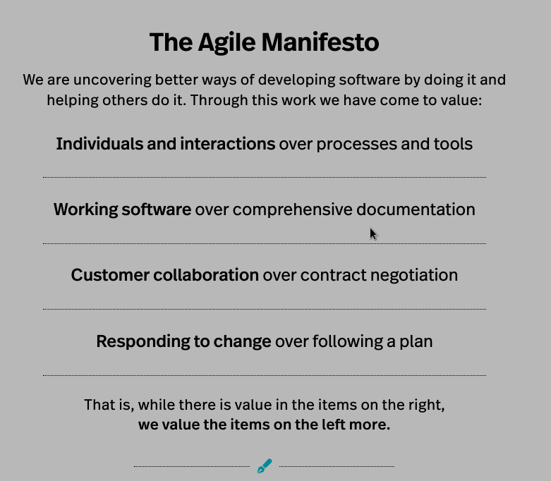

# My learning journey of devOps (Developement and Operations)

Hi 🙋 folks!!  
Welcome to my learning journey of **devOps**.  

This repository contains my notes taken while learning devOps.  

## Introduction

Before having devOps model, Waterfall Model was in use. Agile methodology.  
devOps is not a technology but a methodology.

- DevOps is the unification of Development and Operations. 
- DevOps is all about collaboration.
- DevOps is not a technology, it is cultual movement and set of practices(methodology).
- One of the major goals of DevOps is to shorten the development cycle. (may be by introducing new features, applications, updates, bug fixes)

#### Developement team v/s DevOps team v/s Operations team
- In a company (or) an organisation the roles and responsibilities of the operations team, DevOps team and developement team are distinct but are interconnected  
    | Development team | DevOps team | Operations team |
    |:-----------------|:------------|:----------------|
    | Creating and maintaining software products | Bridging the gap between development and operations to improve efficiency and collaboration, automating processes to facilitate CI/CD | Managing and maintaining IT infrastructure and ensuring the smooth operation of IT services. The team that deploys and monitors the software products. |
    | Goal: How fast they can develop? | Goal: Bring development and operations team together | Goal: How stable is the software is? |

#### DevOps Loop and goals
- DevOps creators are us!! (software community)
- DevOps Loop: Plan --> Build --> CI/CD --> Monitor and Alert --> Operate --> Continuous feedback --> Plan
- DevOps address the issue of conflicting goals betweeen development and operations teams by merging both teams into one DevOps team with shared goals of speed and stability.
- DevOps goals: 
  - Decrease developement cycle time. Which thereby decreases the time to take ideas to market (**Time to market**). Which increases the frequency of software releases.
  - Improving **efficiency** (by collaboration of developers and operations team). Continuous testing in DevOps culture help developers identify and resolve errors immediately, enhancing efficiency.
  - Improving the **quality** of software by continuous monitoring, CI and CD. Continuous integration and devilery help in maintain the quality of software by ensuring changes are functional and secure.
  - Improve **security** (which is known as DevSecOps) by involving security team. 
    - Integration of security team into the DevOps process results in incorporating security from the beginning, enhancing the security of the software developed.
  - Being **resilient** during failures. DevOps aim to handle failures within the software development process by enabiling quick recovery from failures, potentially through automated methods like reverting to previous code versions.

#### Agile methodologies
1) See [agilealliance](https://www.agilealliance.org/agile101/the-agile-manifesto/) for agile manifesto. 
2) Agile is a set of principles that focuses on collaboration, customer feedback and rapid releases. (Old methods of slow planning and infrequent releases don't work.) Focusing on small tasks instead of tackling large projects all at once.
3) Deliver products more frequently.
4) Agile focuses on flow of software from idea to completion. Agile included collaboration between developers and project management team to enhance software products releases. However agile omitted operations team!! Thats where DevOps comes in. DevOps includes developers team and operations team.
5) Frameworks : 
   1) Scurm
   2) Extreme programming
   3) Feature-Driven Development etc..

## Table of contents

## Resources:

1) ATLASSIAN https://www.atlassian.com/devops
2) Agile https://www.agilealliance.org/agile101/the-agile-manifesto/
3) History of devops https://itrevolution.com/articles/the-history-of-devops/
4) Edurekha https://www.youtube.com/watch?v=hQcFE0RD0cQ
